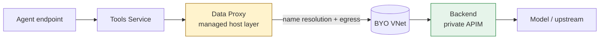

<!-- 언어 토글 -->
**[English](README.md) | 한국어**

<h1 align="center">Foundry Agent Network Diagnostic</h1>

<p align="center">
  <strong>Foundry Agent의 프라이빗 네트워크 경로가 어디서 깨지는지 — 한 번 실행으로 정확히 짚어냅니다.</strong>
</p>

<p align="center">
  <a href="https://github.com/hyeonsangjeon/foundry-agent-network-diagnostic/actions/workflows/ci.yml"></a>
  
  
  
  
  
  
</p>

<p align="center">
  
</p>

<p align="center">
  <em>한 번 실행 → 6개 체크 → 공유 가능한 색상 root-cause 판정.</em><br>
  ▶ <strong>5분 따라하기 영상 (한국어 &amp; English):</strong> <a href="https://github.com/hyeonsangjeon/foundry-agent-network-diagnostic/releases/latest">최신 릴리스</a>에서 보세요.
</p>

> **TL;DR**
> - **무엇을:** Standard Agent(BYO VNet) 환경에서 프라이빗 backend(private APIM / private endpoint)
>   호출이 *어느 단계*에서 깨지는지 격리하는 read-only 일회성 진단 도구. 특히 BYO AI Gateway 경로의
>   **DNS resolution 실패**를 표적으로 합니다.
> - **누구를 위해:** 폐쇄형 VNet에서 Foundry Agent를 운영하는 팀, 그리고 이를 지원하는 엔지니어.
> - **어떻게:** 한 번 실행 → 6개 체크 → root cause 판정이 담긴 색깔 HTML 대시보드.

---

## ✨ 주요 기능 (Features)

- **6단계 진단** — "VM에서는 정상"이라는 baseline부터 "정확히 이 hop에서 깨진다"까지 경로를 따라갑니다.
- **Template 16 토폴로지 diff** — 현재 환경 구성을 공식 private-APIM 패턴과 비교하고,
  *공식 / 현재 환경 / 영향* 3열 표로 **왜 깨지는지**를 설명합니다.
- **단일 파일 정적 HTML 대시보드** — 인터넷·CDN·JS 의존성 없이 열립니다(폐쇄망 안전). 캡처해서 공유하세요.
- **Read-only 안전** — 이미 접근 권한이 있는 구성과 로그만 읽습니다.
- **Support-case 바로 제출용 출력** — Microsoft 지원 티켓에 복붙할 수 있는 요약 블록 제공.
- **BYO VNet 환경 전반 재사용** — config 기반, 하드코딩된 식별자 0.

## 🎯 무엇을 진단하나 (What it diagnoses)

**Standard Agent BYO VNet** 환경에서 Foundry Agent의 managed **Data Proxy**는 프라이빗 backend
(주로 Azure API Management gateway)를 호출합니다. 자주 나오는 헷갈리는 실패 패턴은, 같은 subnet의 VM에서는
backend hostname이 정상 resolve되는데 agent 호출은 다음과 같이 실패하는 경우입니다:

```
Name or service not known
```

이는 **backend에 도달하기 전 name resolution 단계에서의 실패**이지 backend나 TLS 문제가 아닙니다. 이 도구는
어느 단계에서 깨지는지, 그리고 원인이 환경 구성 쪽인지 플랫폼 경로 쪽인지를 격리합니다.

## 🏗️ 동작 원리 (How it works)



이 도구는 **Data Proxy → backend** hop에 집중합니다. Check 1–2가 backend가 살아있고 VM에서 도달 가능함을
증명하고, Check 4–6이 **managed 경로의 resolution 단계**로 문제를 좁힙니다. 전체 경로 모델은
[`docs/PLATFORM_PATTERN.md`](docs/PLATFORM_PATTERN.md)를 참고하세요.

## 📋 사전 요구사항 (Prerequisites)

- **VNet 내부의 Linux jump-box VM** (여기서 도구를 실행합니다).
- **Python 3.10+** (진단 본체는 표준 라이브러리만 사용 — `pip install` 할 것이 없습니다).
- read-only로 인증된 **Azure CLI**: `az login`.
- 관련 리소스 및 (선택) DNS resolver / APIM 로그에 대한 **읽기 권한**.

## 🚀 빠른 시작 (Quickstart)

> 🟢 **처음이세요?** 한 줄씩 복붙하는 단계별 가이드는
> **[`docs/QUICKSTART.ko.md`](docs/QUICKSTART.ko.md)** 부터 시작하세요 — 첫 데모는 Azure가 필요 없습니다.

```bash
# 1. 클론 (진단 본체는 stdlib 전용 — pip install 할 것이 없음)
git clone https://github.com/hyeonsangjeon/foundry-agent-network-diagnostic.git
cd foundry-agent-network-diagnostic

# 2. 인증 (read-only)
az login

# 3. 설정
cp config.sample.json config.json
# config.json에 본인 환경 값을 입력 (config.json은 gitignore 처리됨)

# 4. 진단 실행
python3 src/diagnose.py --config config.json

# 5. 리포트 열기
open report.html        # macOS
# xdg-open report.html  # Linux
```

**지금 바로 Azure 없이 시험해 보기** — 내장 mock 데이터로 전체 대시보드를 렌더합니다:

```bash
python3 src/diagnose.py --config config.sample.json --mock
open report.html
```

**일부 체크만** 실행:

```bash
python3 src/diagnose.py --config config.json --checks 1,2,4
```

전체 설치/사용 가이드: [`docs/USAGE.ko.md`](docs/USAGE.ko.md).

## 🧭 두 가지 진단 방법

일회용 **재현 랩**을 띄워서 도구가 처음부터 끝까지 동작하는 것을 보거나, **이미 가지고 있는
환경**을 가리켜 진단할 수 있습니다. 두 방법 모두 동일한 읽기 전용 `report.html`로 끝납니다.
전체 가이드: [`docs/DEPLOYMENT.ko.md`](docs/DEPLOYMENT.ko.md).

| | **방법 1 — 배포 후 검증** | **방법 2 — 기존 환경 검증** |
| --- | --- | --- |
| 사용 시점 | 도구가 동작하는 것을 깔끔하게 보고 싶을 때 | 이미 배포된 환경이 있을 때 |
| Azure 리소스 생성? | 예(본인 소유의 작은 랩) | **아니오** — 읽기 전용 |
| 명령 | `bash deploy/deploy.sh` | `bash deploy/verify-existing.sh` |

**방법 1 — 재현 랩을 배포한 뒤 검증:**

```bash
bash deploy/deploy.sh --what-if --location eastus              # 무료 미리보기, 아무것도 안 만듦
bash deploy/deploy.sh --scenario lab --location eastus --yes   # 배포 → 진단 → report.html
bash deploy/destroy.sh --resource-group rg-agent-net-lab --yes # 끝나면 삭제
```

작은 실제 네트워크 경로(VNet + 위임된 agent subnet + 커스텀 프라이빗 FQDN 뒤의 프라이빗
엔드포인트 백엔드)를 프로비저닝하고, 출력으로 `config.json`을 작성한 뒤 진단을 실행하여
`report.html`을 엽니다. 충실한(단, 약 45분·비용↑) API Management 게이트웨이 경로는
`--scenario apim`을 사용하세요.

**방법 2 — 이미 배포된 환경 검증** (아무것도 만들지 않음):

```bash
bash deploy/verify-existing.sh        # 엔드포인트 + 네트워크 설정을 입력받아 진단
```

> Azure 리소스를 건드리는 것은 `deploy.sh` / `destroy.sh`(사용자가 지정한 리소스 그룹)뿐입니다.
> **진단 자체는 항상 읽기 전용입니다.**

<details>
<summary>콘솔 출력 예시 (mock)</summary>

```
Foundry Agent Network Diagnostic
  mode=mock  generated=2026-06-22T05:17:28Z  v1.0.1
------------------------------------------------------------------------
            [PASS]  Hostname resolution (VM perspective)
            [PASS]  Backend reachability (network layer)
            [WARN]  Foundry connection topology
            [WARN]  Topology diff vs official Template 16
            [FAIL]  DNS query observation (root-cause)
            [FAIL]  APIM gateway log correlation
------------------------------------------------------------------------
  PASS=2  WARN=2  FAIL=2  SKIPPED=0  INFO=0

  VERDICT: DNS query never reached your resolver — the managed agent path appears to bypass this VNet DNS path
           Check 6 corroborates: no request reached APIM in the window — the break is before the backend.
```
</details>

## 🔍 6개의 체크 (The 6 checks)

| # | 체크 | 무엇을 보나 | PASS / WARN / FAIL 의미 |
| --- | --- | --- | --- |
| 1 | **Hostname resolution (VM)** | VM에서 backend FQDN resolve, `/etc/resolv.conf` 덤프 | PASS = VM baseline 정상 · FAIL = VM resolve 실패 |
| 2 | **Backend reachability** | VIP:443에 TCP + TLS (SNI = 대상 FQDN) | PASS = backend 생존·도달 가능 · FAIL = 네트워크/backend 문제 |
| 3 | **Foundry connection topology** | connection category(`ModelGateway` vs `ApiManagement`), agent subnet delegation | WARN = 권장 패턴과 상이 |
| 4 | **Template 16 토폴로지 diff** | 5개 dimension diff: 공식 / 현재 환경 / 영향 | WARN = 지원 패턴과 상이 |
| 5 | **DNS query 관측** ★ | FQDN 질의가 resolver에 도착했나? 3-way 판정 | FAIL = 질의 없음/실패 · root-cause 방향 |
| 6 | **APIM gateway log 대조** | 같은 시각 APIM에 request가 도착했나? | FAIL = APIM 도달 전 실패(DNS 단계) |

★ Check 5가 핵심입니다. **환경 구성**(DNS zone-link / forwarding)과 **플랫폼 경로**(managed resolver
동작)를 가릅니다.

## 📊 출력 예시 (Sample output)

<p align="center">
  
</p>

위 대시보드([`examples/sample_report.html`](examples/sample_report.html))는 다음을 보여줍니다:

- 상단의 **root-cause 판정 배너** (3-way 결과 중 어디인지 + 한 줄 설명),
- raw 근거가 담긴 6개의 **색깔 카드** (녹 PASS / 노 WARN / 적 FAIL / 회 SKIPPED),
- **Check 4 토폴로지 표**,
- 하단의 **복붙용 support-case 블록**.

## 🔒 안전성 (Safety)

> **이 도구는 read-only이며 리소스를 일절 변경하지 않습니다.**
> 이미 접근 권한이 있는 구성과 로그만 읽습니다. 어떤 리소스도 생성/수정/삭제하지 않습니다. 생성된 리포트는
> `config.json`에 입력한 값만 포함하며, `config.json`은 gitignore 처리되어 커밋되지 않습니다.

## 💡 예시 시나리오 (Example scenario)

규제 산업의 한 기업이 BYO VNet에서 Standard Agent를 운영하며, **classic internal-mode APIM**을
**custom private-only FQDN**(`llm.<your-apim>.<your-domain>`) 뒤에 두고 있습니다. agent subnet의 VM은 그
FQDN을 resolve하고 443으로 APIM에 도달하는데도, agent 호출은 `Name or service not known`으로 실패합니다.
이 도구를 실행하면: Check 1–2 **PASS**(VM·backend 정상), Check 4 **WARN**(Template 16 대비 4개 dimension
상이), Check 5–6 **FAIL**(재현 시각에 DNS 질의·APIM request 없음). 판정: 문제는 **backend 도달 전,
resolution 단계** — 방향은 *플랫폼 경로*, "확인 필요"로 표기.

## ❓ FAQ / 문제 해결

- **무엇을 설치해야 하나요?** 아니요 — 진단 본체는 표준 라이브러리만 씁니다. `requirements.txt`에는 SDK
  A/B 헬퍼용 *선택* 패키지만 적혀 있습니다.
- **`az` 호출이 권한 오류를 냅니다.** 해당 체크는 manual-input fallback과 함께 **SKIPPED**가 됩니다 —
  도구는 절대 크래시하지 않습니다. 가능하면 더 넓은 읽기 권한으로 다시 실행하세요.
- **Check 5/6이 SKIPPED입니다.** Log Analytics workspace를 제공하지 않아 manual 모드로 동작한 것입니다.
  각 체크가 출력하는 한 가지 질문에 답하거나, `config.json`에 `dns_resolver_log` / `apim_gateway_log`를
  추가하세요.
- **오프라인/폐쇄망에서 실행 가능한가요?** 네. `report.html`은 외부 의존성 없는 단일 파일이며, `--mock`은
  Azure·네트워크 없이 동작합니다.
- **리포트를 공유해도 안전한가요?** 네 — `config.json` 값만 포함합니다. 공유 전 가릴 필요가 있으면
  placeholder를 사용하세요.

## 📚 참고 자료 (References)

- [`docs/QUICKSTART.ko.md`](docs/QUICKSTART.ko.md) — 처음 사용하는 분을 위한 단계별 로컬 실행 가이드.
- [`docs/REFERENCES.md`](docs/REFERENCES.md) — **Template 16** baseline을 정의하는 공식 Microsoft Learn
  문서 및 foundry-samples의 network-secured Standard Agent(private-APIM) 템플릿.
- [`docs/PLATFORM_PATTERN.md`](docs/PLATFORM_PATTERN.md) — Foundry Agent 경로 모델과 internal-mode +
  custom FQDN이 왜 다른지에 대한 해설.
- [`docs/SUPPORT_CASE_GUIDE.md`](docs/SUPPORT_CASE_GUIDE.md) — Microsoft support case에 포함할 항목.
- [`docs/DEPLOYMENT.ko.md`](docs/DEPLOYMENT.ko.md) — 두 가지 진단 방법 + 재현 랩 배포 자동화.

## 📝 변경 이력 (Changelog)

[`CHANGELOG.md`](CHANGELOG.md) 참조. 현재 릴리스: **v1.1.0**.

## 👤 작성자 (Author)

**Hyeonsang Jeon** · Microsoft Global Black Belt AI Apps

---

**[English](README.md) | 한국어** · [MIT](LICENSE) 라이선스.
