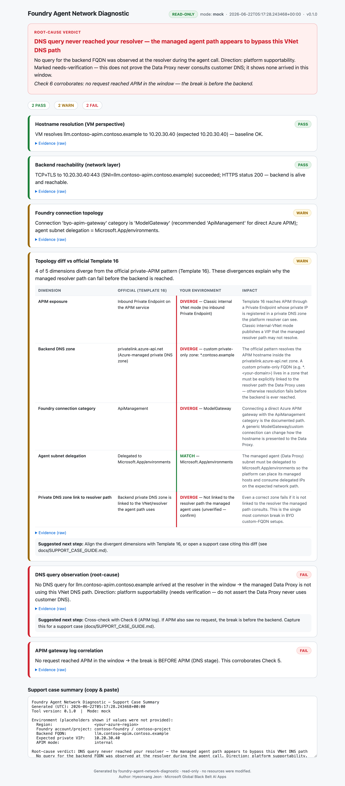
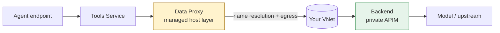

<!-- Language toggle -->
**English | [한국어](README.ko.md)**

<h1 align="center">Foundry Agent Network Diagnostic</h1>

<p align="center">
  <strong>Pinpoint exactly where a Foundry Agent's private network path breaks — in one run.</strong>
</p>

<p align="center">
  
  
  
  
  
  
</p>

<p align="center">
  
</p>

> **TL;DR**
> - **What:** a read-only, one-shot diagnostic that isolates *where* a Standard Agent (BYO VNet)
>   call to a private backend (private APIM / private endpoint) breaks — targeting DNS resolution
>   failures on the BYO AI Gateway path.
> - **Who:** customers running Foundry Agents in a locked-down VNet, and the engineers who support them.
> - **How:** one command → six checks → a color-coded HTML dashboard with a clear root-cause verdict.

---

## ✨ Features

- **6-check diagnostic** that walks the path from "the VM is fine" to "here's the exact hop that breaks".
- **Template 16 topology diff** — compares your config to the official private-APIM pattern, with an
  *official / your environment / impact* table that explains **why** the path fails.
- **Static single-file HTML dashboard** — opens with no internet, no CDN, no JS dependencies
  (closed-network safe). Capture it and share it.
- **Read-only and safe** — only reads configuration and logs you already have access to.
- **Support-case-ready output** — a copy-paste summary block sized for a Microsoft support ticket.
- **Reusable across BYO VNet customers** — config-driven, zero hardcoded identifiers.

## 🎯 What it diagnoses

In a **Standard Agent BYO VNet** environment, a Foundry Agent's managed **Data Proxy** calls a
private backend (commonly an Azure API Management gateway). A frequent, confusing failure: a VM in
the same subnet resolves the backend hostname fine, but the agent call fails with:

```
Name or service not known
```

That is a **name-resolution failure before the backend is ever reached** — not a backend or TLS
problem. This tool isolates which stage breaks and whether the cause points to your configuration
or to the platform path.

## 🏗️ How it works



The tool concentrates on the **Data Proxy → backend** hop. Checks 1–2 prove the backend is healthy
and reachable from a VM; Checks 4–6 localize the break to the **resolution stage on the managed
path**. See [`docs/PLATFORM_PATTERN.md`](docs/PLATFORM_PATTERN.md) for the full path model.

## 📋 Prerequisites

- A **Linux jump-box VM inside the VNet** (run the tool from there).
- **Python 3.10+** (the diagnostic uses the standard library only — nothing to `pip install`).
- **Azure CLI** authenticated read-only: `az login`.
- **Read access** to the relevant resources and (optionally) the DNS resolver / APIM logs.

## 🚀 Quickstart

```bash
# 1. Clone & install (no third-party deps required for the diagnostic itself)
git clone https://github.com/hyeonsangjeon/foundry-agent-network-diagnostic.git
cd foundry-agent-network-diagnostic
pip install -r requirements.txt

# 2. Authenticate (read-only)
az login

# 3. Configure
cp config.sample.json config.json
# edit config.json with your environment values (config.json is gitignored)

# 4. Run the diagnostic
python src/diagnose.py --config config.json

# 5. Open the report
open report.html        # macOS
# xdg-open report.html  # Linux
```

**Try it right now with zero Azure** — built-in mock data renders the full dashboard:

```bash
python src/diagnose.py --config config.sample.json --mock
open report.html
```

Run a **subset of checks**:

```bash
python src/diagnose.py --config config.json --checks 1,2,4
```

Full install/usage walkthrough: [`docs/USAGE.md`](docs/USAGE.md).

<details>
<summary>Example console output (mock)</summary>

```
Foundry Agent Network Diagnostic
  mode=mock  generated=2026-06-22T05:17:28Z  v0.1.0
------------------------------------------------------------------------
            [PASS]  Hostname resolution (VM perspective)
            [PASS]  Backend reachability (network layer)
            [WARN]  Foundry connection topology
            [WARN]  Topology diff vs official Template 16
            [FAIL]  DNS query observation (root-cause)
            [FAIL]  APIM gateway log correlation
------------------------------------------------------------------------
  PASS=2  WARN=2  FAIL=2  SKIPPED=0  INFO=0

  VERDICT: DNS query never reached your resolver — the managed agent path appears to bypass this VNet DNS path
           Check 6 corroborates: no request reached APIM in the window — the break is before the backend.
```
</details>

## 🔍 The 6 checks

| # | Check | What it looks at | PASS / WARN / FAIL means |
| --- | --- | --- | --- |
| 1 | **Hostname resolution (VM)** | Resolves the backend FQDN from the VM; dumps `/etc/resolv.conf` | PASS = VM baseline OK · FAIL = VM can't resolve |
| 2 | **Backend reachability** | TCP + TLS to the VIP:443 (SNI = your FQDN) | PASS = backend alive & reachable · FAIL = network/backend issue |
| 3 | **Foundry connection topology** | Connection category (`ModelGateway` vs `ApiManagement`); agent subnet delegation | WARN = diverges from recommended |
| 4 | **Topology diff vs Template 16** | 5-dimension diff: official / your environment / impact | WARN = config diverges from the supported pattern |
| 5 | **DNS query observation** ★ | Did a query for the FQDN reach the resolver? 3-way verdict | FAIL = no query / failed query · root-cause direction |
| 6 | **APIM gateway log correlation** | Did a request reach APIM in the same window? | FAIL = break is before APIM (DNS stage) |

★ Check 5 is the heart: it splits **customer configuration** (DNS zone-link / forwarding) from the
**platform path** (managed resolver behavior).

## 📊 Sample output

The dashboard ([`examples/sample_report.html`](examples/sample_report.html), pictured above) shows:

- a **root-cause verdict banner** at the top (which of the 3-way outcomes + a one-line explanation),
- six **color-coded cards** (green PASS / amber WARN / red FAIL / grey SKIPPED) with raw evidence,
- the **Check 4 topology table**, and
- a **copy-paste support-case block** at the bottom.

## 🔒 Safety

> **This tool is read-only and makes NO changes to your resources.**
> It only reads configuration and logs you already have access to. No resource is ever created,
> updated, or deleted. The generated reports contain only the values you put in `config.json`
> (which is gitignored so it is never committed).

## 💡 Example scenario

A regulated enterprise runs a Standard Agent in a BYO VNet, with a **classic internal-mode APIM**
behind a **custom private-only FQDN** (`llm.<your-apim>.<your-domain>`). A VM in the agent subnet
resolves that FQDN and reaches APIM on 443 — yet the agent call fails with `Name or service not
known`. Running this tool produces: Checks 1–2 **PASS** (VM + backend fine), Check 4 **WARN**
(four dimensions diverge from Template 16), Checks 5–6 **FAIL** (no DNS query and no APIM request at
repro time). Verdict: the break is **before the backend, at the resolution stage** — direction
*platform path*, marked "needs verification". That is exactly what to bring to a support case.

## ❓ FAQ / Troubleshooting

- **Do I need to install anything?** No — the diagnostic is standard-library only. `requirements.txt`
  only lists *optional* extras for the SDK A/B helper.
- **`az` calls return permission errors.** Those checks become **SKIPPED** with a manual-input
  fallback — the tool never crashes. Re-run with broader read access if you can.
- **Check 5/6 are SKIPPED.** You didn't provide a Log Analytics workspace, so they ran in manual
  mode. Answer the single question each prints, or add `dns_resolver_log` / `apim_gateway_log` to
  `config.json`.
- **Can I run it offline / in a closed network?** Yes. `report.html` is a single self-contained file
  with no external dependencies. `--mock` runs with no Azure or network at all.
- **Is it safe to share the report?** Yes — it contains only your `config.json` values. Use
  placeholders if you need to redact before sharing.

## 📚 References

- [`docs/REFERENCES.md`](docs/REFERENCES.md) — official Microsoft Learn pages and the foundry-samples
  network-secured Standard Agent (private-APIM) templates that define the **Template 16** baseline.
- [`docs/PLATFORM_PATTERN.md`](docs/PLATFORM_PATTERN.md) — the Foundry Agent path model and why
  internal-mode + custom FQDN diverges.
- [`docs/SUPPORT_CASE_GUIDE.md`](docs/SUPPORT_CASE_GUIDE.md) — what to include in a Microsoft support case.

## 📝 Changelog

See [`CHANGELOG.md`](CHANGELOG.md). Current release: **v0.1.0**.

## 👤 Author

**Hyeonsang Jeon** · Microsoft Global Black Belt AI Apps

---

**English | [한국어](README.ko.md)** · Licensed under [MIT](LICENSE).
