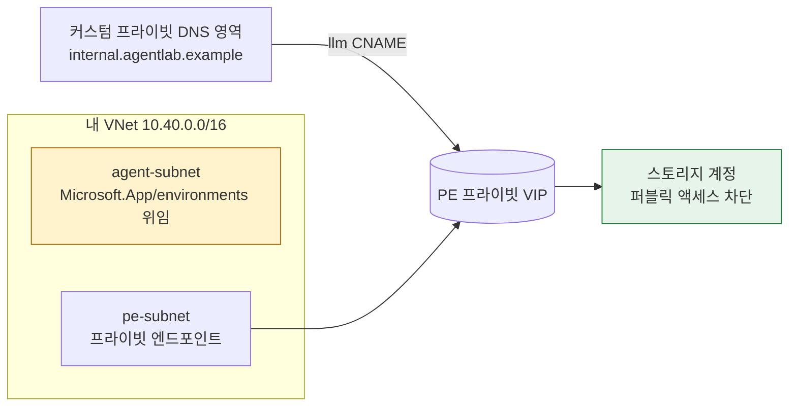

# 배포 & 두 가지 진단 방법

**[English](DEPLOYMENT.md) | 한국어**

이 저장소는 근본 원인 리포트를 얻는 **두 가지 방법**을 제공합니다. 두 방법 모두
동일한 **읽기 전용** 진단과 동일한 정적 `report.html`로 끝납니다.

| | 방법 1 — 배포 후 검증 | 방법 2 — 기존 환경 검증 |
| --- | --- | --- |
| **사용 시점** | 도구가 동작하는 것을 처음부터 끝까지 보고 싶을 때(재현 랩) | 이미 배포된 환경을 진단할 때 |
| **Azure 리소스 생성?** | 예 — 본인 소유 리소스 그룹에 작은 랩 생성 | **아니오** — 읽기 전용 |
| **스크립트** | `deploy/deploy.sh` | `deploy/verify-existing.sh` |
| **정리(삭제)** | `deploy/destroy.sh` | 해당 없음 |

> **진단 엔진은 항상 읽기 전용입니다.** 리소스를 생성/삭제하는 것은
> `deploy/deploy.sh`와 `deploy/destroy.sh`뿐이며, 사용자가 지정한 리소스 그룹
> 내부에서만 동작합니다. 재현 랩은 선택(opt-in) 기능입니다.

---

## 방법 1 — 재현 랩을 배포한 뒤 검증

`deploy/deploy.sh`는 Foundry Standard Agent BYO VNet → 프라이빗 백엔드 토폴로지와
같은 *형태*의 작은 실제 네트워크 경로를 프로비저닝한 다음, 그 위에서 진단을 실행하고
`report.html`을 가리켜 줍니다.

### 배포되는 것



- `Microsoft.App/environments`에 **위임된 agent subnet**(Check 3/4가 확인하는 Standard
  Agent 요구사항), **프라이빗 엔드포인트 subnet**, jump/APIM subnet을 가진 **VNet**;
- VNet에 연결된 **커스텀 프라이빗 전용 DNS 영역**(`internal.agentlab.example`) — "프라이빗
  으로만 해석되는 커스텀 FQDN" 상황을 재현합니다;
- **프라이빗 백엔드**: 기본값은 **프라이빗 엔드포인트** 뒤의 스토리지 계정이며, 커스텀
  FQDN `llm.internal.agentlab.example`가 스토리지 프라이빗 엔드포인트로 CNAME되어 PE
  프라이빗 VIP로 해석됩니다.

두 가지 시나리오:

| `--scenario` | 백엔드 | 소요 시간 | 비용 | 용도 |
| --- | --- | --- | --- | --- |
| `lab`(기본) | 스토리지 + 프라이빗 엔드포인트 | 약 2~3분 | 매우 낮음 | Check 1/2/4 경로의 빠른 데모 |
| `apim` | API Management, 내부 VNet 모드 | **약 45분** | 높음 | Check 3/5/6용 충실한 BYO AI Gateway 경로 |

### 사전 준비

- **Contributor 권한**이 있는 구독에 **Azure CLI 로그인**(`az login`) — 리소스 그룹과 위
  리소스를 만들 수 있어야 합니다.
- 구독에 `Microsoft.Network`, `Microsoft.Storage`, `Microsoft.App`(그리고 `--scenario
  apim`이면 `Microsoft.ApiManagement`) 리소스 공급자가 **등록**되어 있어야 합니다.
  스크립트가 등록을 시도하지만, 많은 엔터프라이즈 구독에서는 관리자만 등록할 수 있습니다.
  등록이 거부되면 경고만 출력하고 계속 진행하며, 공급자가 이미 등록되어 있으면 배포는
  정상 동작합니다.
- 진단 실행을 위한 **Python 3.10+**.

### 먼저 미리보기 (무료, 아무것도 만들지 않음)

```bash
bash deploy/deploy.sh --what-if --location eastus
```

`--what-if`는 사전 점검 → 리소스 그룹 확인 → 템플릿 검증 → ARM **what-if** 미리보기를
출력한 뒤 멈춥니다. 과금되는 리소스를 만들지 않습니다.

### 배포 및 검증

```bash
# 빠른 랩 (첫 실행 권장)
bash deploy/deploy.sh --scenario lab --env-name agent-net-lab --location eastus --yes

# 충실한 APIM 경로 (느리고 비용 높음)
bash deploy/deploy.sh --scenario apim --env-name agent-apim --location eastus --yes
```

스크립트는 진행률 막대와 `.deployment/` 아래 타임스탬프 로그와 함께 다음을 수행합니다:

1. 도구 + `az login` 확인;
2. 설정 확정;
3. 리소스 공급자 등록(best-effort);
4. 리소스 그룹 생성;
5. Bicep 템플릿 검증;
6. what-if 미리보기 표시(`--yes`가 아니면 확인 요청);
7. 랩 배포;
8. 배포 출력으로부터 `config.json` 작성;
9. `python src/diagnose.py --config config.json` 실행 → `report.html` 생성.

리포트 열기:

```bash
open report.html        # macOS
# xdg-open report.html  # Linux
```

> **참고:** 랩은 Foundry 계정을 프로비저닝하지 않으므로 Foundry 관련 체크(Check 3 및
> 로그 기반 Check 5/6)는 **SKIPPED / 수동**으로 보고됩니다 — 정상입니다. **네트워크 경로**
> 체크(1, 2, 4)는 실제 리소스에 대해 실제로 실행됩니다. 커스텀 FQDN 뒤에 실제 게이트웨이가
> 필요하면 `--scenario apim`을 사용하세요.

### 유용한 플래그

| 플래그 | 의미 |
| --- | --- |
| `--scenario lab\|apim` | 재현 시나리오(기본 `lab`). |
| `--env-name <name>` | 랩 기본 이름(기본 `agent-net-lab`). |
| `--location <region>` | Azure 지역(기본 `eastus`). |
| `--resource-group <name>` | 리소스 그룹(기본 `rg-<env-name>`). |
| `--subscription <id\|name>` | 대상 구독(기본: 현재 `az` 컨텍스트). |
| `--custom-zone <zone>` / `--custom-host <label>` | 백엔드 FQDN 커스터마이즈. |
| `--deploy-jump-vm` + `--vm-password <pwd>` | 인-네트워크 jump VM도 배포. |
| `--what-if` | 미리보기만 — 아무것도 만들지 않음. |
| `--no-diagnose` | 배포만 하고 진단은 건너뜀. |
| `--yes` | 배포 전 확인 생략. |
| `--no-color` | 단색 출력(CI/로그용). |

### 정리(삭제)

```bash
bash deploy/destroy.sh --resource-group rg-agent-net-lab --yes
```

리소스 그룹 전체를 삭제합니다. 반드시 랩용으로 만든 그룹만 지정하세요.

---

## 방법 2 — 이미 배포된 환경 검증

실제로 이미 배포된 환경이라면 아무것도 배포하지 않습니다. 엔드포인트 + 네트워크 설정만
입력하고 읽기 전용 진단을 실행합니다.

### 대화형 (전달하지 않은 값은 프롬프트로 입력)

```bash
bash deploy/verify-existing.sh
```

필수 7개 값(구독, 리소스 그룹, 지역, Foundry 계정, Foundry 프로젝트, 백엔드 FQDN, 예상
프라이빗 VIP)과 선택 값(agent/PE subnet ID, APIM 리소스 ID, APIM 모드)을 물어본 뒤
`config.json`을 작성하고 진단을 실행합니다.

### 비대화형 (플래그)

```bash
bash deploy/verify-existing.sh \
  --subscription-id 00000000-0000-0000-0000-000000000000 \
  --resource-group rg-foundry --region eastus \
  --foundry-account my-foundry --foundry-project my-project \
  --backend-fqdn llm.my-apim.internal.example --expected-vip 10.20.30.40 \
  --apim-mode internal
```

### 또는 진단을 직접 실행

방법 2는 편의 래퍼일 뿐입니다. 언제든 직접 할 수 있습니다:

```bash
cp config.sample.json config.json
# config.json을 본인 값으로 편집
python src/diagnose.py --config config.json
```

전체 config 스키마와 체크별 세부 사항은 [`USAGE.ko.md`](USAGE.ko.md)를 참고하세요.

---

## 파일 구성

```
deploy/
├── deploy.sh                 # 방법 1: 랩 프로비저닝 → 진단
├── verify-existing.sh        # 방법 2: 기존 환경 → 진단
├── destroy.sh                # 정리(삭제)
├── _write_config.py          # 배포 출력 → config.json (deploy.sh 사용)
├── _write_config_manual.py   # FANDX_* 환경변수 → config.json (verify-existing.sh 사용)
└── infra/
    ├── main.bicep            # 재현 랩 템플릿
    └── main.parameters.json  # 기본 파라미터
```

배포 산출물(`.deployment/` 로그, `config.json`, `report.*`)은 **gitignore** 처리됩니다.

## 안전 & 비용

- **진단은 Azure를 변경하지 않습니다.** 배포/삭제는 명확히 분리된 선택 기능이며,
  사용자가 지정한 리소스 그룹으로 한정됩니다.
- `lab` 시나리오는 의도적으로 매우 작고 저렴하지만, **끝나면** `destroy.sh`로 삭제하여
  불필요한 과금을 막으세요.
- `apim` 시나리오는 API Management(Developer SKU)를 프로비저닝합니다 — **느리고(약 45분)
  비용이 더 큽니다**. 충실한 게이트웨이 경로가 필요할 때만 사용하세요.
- 비밀은 커밋되지 않습니다: `config.json`과 모든 배포 로그는 gitignore 처리됩니다.
