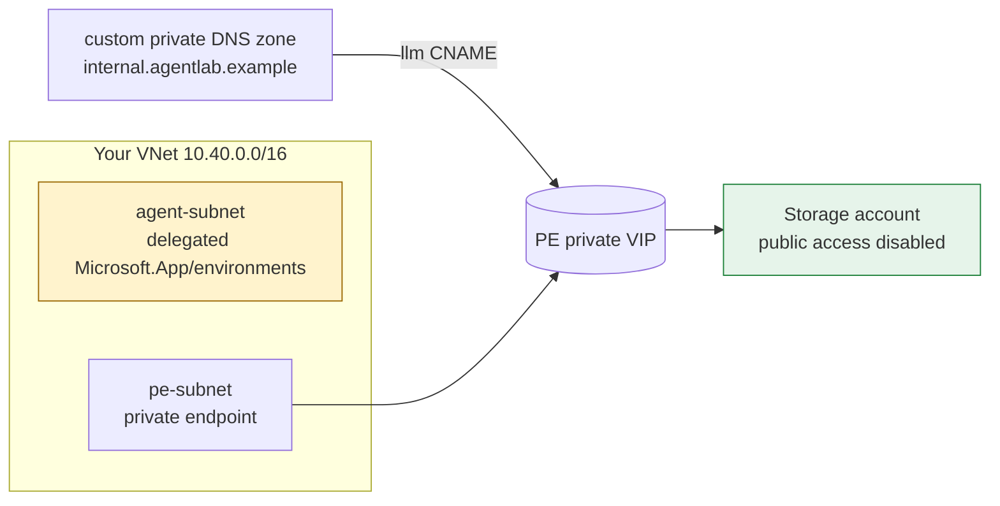

# Deployment & the two ways to diagnose

**English | [한국어](DEPLOYMENT.ko.md)**

This repo gives you **two ways** to get a root-cause report. Both end at the same
read-only diagnostic and the same static `report.html`.

| | Method 1 — deploy & verify | Method 2 — verify existing |
| --- | --- | --- |
| **Use when** | You want a clean reproduction lab to see the tool work end to end | You already have a deployed environment to diagnose |
| **Creates Azure resources?** | Yes — a small lab in a resource group you own | **No** — read-only |
| **Script** | `deploy/deploy.sh` | `deploy/verify-existing.sh` |
| **Teardown** | `deploy/destroy.sh` | n/a |

> The **diagnostic engine is always read-only.** Only `deploy/deploy.sh` and
> `deploy/destroy.sh` create or delete resources, and only inside a resource group
> you choose. The reproduction lab is opt-in.

---

## Method 1 — deploy a reproduction lab, then verify

`deploy/deploy.sh` provisions a small, real network path that has the same *shape*
as a Foundry Standard Agent BYO VNet → private backend topology, then runs the
diagnostic against it and points you at `report.html`.

### What it deploys



- a **VNet** with an **agent subnet** delegated to `Microsoft.App/environments` (the
  Standard Agent requirement Check 3/4 look for), a **private-endpoint subnet**, plus
  jump/APIM subnets;
- a **custom private-only DNS zone** (`internal.agentlab.example`) linked to the VNet —
  this reproduces the "custom FQDN that only resolves privately" situation;
- a **private backend**: by default a Storage account fronted by a **Private Endpoint**,
  with the custom FQDN `llm.internal.agentlab.example` CNAMEd to the storage
  private endpoint (which resolves to the PE's private VIP).

Two scenarios:

| `--scenario` | Backend | Time | Cost | Use |
| --- | --- | --- | --- | --- |
| `lab` (default) | Storage + Private Endpoint | ~2–3 min | Very low | Fast demo of the path Checks 1/2/4 inspect |
| `apim` | API Management, internal VNet mode | **~45 min** | Higher | Faithful BYO AI Gateway path for Checks 3/5/6 |

### Prerequisites

- **Azure CLI** logged in (`az login`) to a subscription where you have **Contributor**
  (you must be able to create a resource group and the resources above).
- The resource providers `Microsoft.Network`, `Microsoft.Storage`, `Microsoft.App`
  (and `Microsoft.ApiManagement` for `--scenario apim`) **registered** on the
  subscription. The script tries to register them, but in many enterprise
  subscriptions only an admin can — if registration is denied it warns and continues,
  and the deploy still works if the providers are already registered.
- **Python 3.10+** (for the diagnostic).

### Preview first (free, creates nothing)

```bash
bash deploy/deploy.sh --what-if --location eastus
```

`--what-if` runs preflight, ensures the resource group, validates the template, and
prints an ARM **what-if** preview — then stops. No billable resource is created.

### Deploy and verify

```bash
# fast lab (recommended first run)
bash deploy/deploy.sh --scenario lab --env-name agent-net-lab --location eastus --yes

# faithful APIM path (slow, costs more)
bash deploy/deploy.sh --scenario apim --env-name agent-apim --location eastus --yes
```

> **Tip — match the customer's region.** For the most faithful reproduction, deploy the
> lab in the **same region as the Foundry environment you're diagnosing** (e.g.
> `--location koreacentral`). The diagnostic logic itself is region-independent — DNS
> resolution, TCP reachability, and the Template 16 topology diff don't change by region —
> but matching the region rules out region-specific availability quirks and keeps the repro
> apples-to-apples.

The script will, with a live progress bar and a timestamped log under `.deployment/`:

1. check tools + `az login`;
2. resolve settings;
3. register resource providers (best-effort);
4. create the resource group;
5. validate the Bicep template;
6. show a what-if preview (and ask to confirm, unless `--yes`);
7. deploy the lab;
8. write `config.json` from the deployment outputs;
9. run `python src/diagnose.py --config config.json` and produce `report.html`.

Then open the report:

```bash
open report.html        # macOS
# xdg-open report.html  # Linux
```

> **Note:** the lab does not provision a Foundry account, so the Foundry-specific
> checks (Check 3, and the log-based Checks 5/6) report **SKIPPED / manual** — that is
> expected. The **network-path** checks (1, 2, 4) run for real against live resources.
> Use `--scenario apim` when you need a real gateway behind the custom FQDN.

### Deploy against a separate (external) tenant — safely

If your default `az login` points at a subscription where you are **read-only**
(common on corporate/internal subs), deploy the lab into a different tenant/subscription
using an **isolated Azure CLI profile** so your default login is never touched.

1. Log in **once** to an isolated profile directory:

   ```bash
   AZURE_CONFIG_DIR=~/.azure-agent-net-ext az login --tenant <external-tenant-id>
   ```

2. Copy `.env.sample` to `.env.external.local` (already git-ignored) and fill it in:

   ```bash
   cp .env.sample .env.external.local
   # edit: EXTERNAL_AZURE_CONFIG_DIR, EXTERNAL_TENANT_ID, SUBSCRIPTION, LOCATION,
   #       and the safety rails E2E_EXPECTED_TENANT_ID / E2E_EXPECTED_SUBSCRIPTION_NAME
   ```

3. Preview, deploy, and tear down — all against the external profile:

   ```bash
   bash deploy/deploy.sh  --env-file .env.external.local --what-if
   bash deploy/deploy.sh  --env-file .env.external.local --scenario lab --yes
   bash deploy/destroy.sh --env-file .env.external.local --resource-group rg-agent-net-lab --yes
   ```

`--env-file` sources the file, sets `AZURE_CONFIG_DIR` to `EXTERNAL_AZURE_CONFIG_DIR`
(so **every** `az` call in that run — including the diagnostic's — uses the isolated
profile), and enforces **safety rails**: the run aborts unless the active tenant and
subscription match `E2E_EXPECTED_TENANT_ID` / `E2E_EXPECTED_SUBSCRIPTION_NAME`. This
makes it impossible to accidentally deploy into the wrong tenant. CLI flags still win
over env-file values, and env-file values win over defaults.

> `verify-existing.sh` also accepts `--env-file` so the read-only diagnostic queries
> the external tenant through the same isolated profile.

### Useful flags

| Flag | Meaning |
| --- | --- |
| `--env-file <path>` | Load settings (e.g. `.env.external.local`) and use an isolated `az` profile via `EXTERNAL_AZURE_CONFIG_DIR`, with tenant/subscription safety rails. |
| `--tenant <id>` | Expected tenant for the safety-rail check (overrides the env file). |
| `--scenario lab\|apim` | Reproduction scenario (default `lab`). |
| `--env-name <name>` | Base name for the lab (default `agent-net-lab`). |
| `--location <region>` | Azure region (default `eastus`). |
| `--resource-group <name>` | Resource group (default `rg-<env-name>`). |
| `--subscription <id\|name>` | Target subscription (default: current `az` context). |
| `--custom-zone <zone>` / `--custom-host <label>` | Customize the backend FQDN. |
| `--deploy-jump-vm` + `--vm-password <pwd>` | Also deploy a small in-network jump VM. |
| `--what-if` | Preview only — creates nothing. |
| `--no-diagnose` | Deploy only; skip running the diagnostic. |
| `--yes` | Don't prompt before deploying. |
| `--no-color` | Plain output (good for CI / logs). |

### Tear it down

```bash
bash deploy/destroy.sh --resource-group rg-agent-net-lab --yes

# external tenant (isolated profile):
bash deploy/destroy.sh --env-file .env.external.local --resource-group rg-agent-net-lab --yes
```

Deletes the whole resource group. Point it only at a group you created for the lab.

---

## Method 2 — verify an environment that is already deployed

For a real, already-deployed environment, you don't deploy anything — you just supply
the endpoint + network settings and run the read-only diagnostic.

### Guided (prompts for anything you don't pass)

```bash
bash deploy/verify-existing.sh
```

It asks for the seven required values (subscription, resource group, region, Foundry
account, Foundry project, backend FQDN, expected private VIP) and the optional ones
(agent/PE subnet IDs, APIM resource ID, APIM mode), writes `config.json`, and runs the
diagnostic.

### Non-interactive (flags)

```bash
bash deploy/verify-existing.sh \
  --subscription-id 00000000-0000-0000-0000-000000000000 \
  --resource-group rg-foundry --region eastus \
  --foundry-account my-foundry --foundry-project my-project \
  --backend-fqdn llm.my-apim.internal.example --expected-vip 10.20.30.40 \
  --apim-mode internal
```

### Or just use the diagnostic directly

Method 2 is a convenience wrapper. You can always do it by hand:

```bash
cp config.sample.json config.json
# edit config.json with your values
python src/diagnose.py --config config.json
```

See [`USAGE.md`](USAGE.md) for the full config schema and per-check details.

---

## Files

```
deploy/
├── deploy.sh                 # Method 1: provision lab → diagnose
├── verify-existing.sh        # Method 2: existing env → diagnose
├── destroy.sh                # teardown
├── _write_config.py          # deployment outputs → config.json (used by deploy.sh)
├── _write_config_manual.py   # FANDX_* env → config.json (used by verify-existing.sh)
└── infra/
    ├── main.bicep            # reproduction lab template
    └── main.parameters.json  # default parameters
```

Deployment artifacts (`.deployment/` logs, `config.json`, `report.*`) are **gitignored**.

## Safety & cost

- The **diagnostic never mutates Azure.** Deploy/destroy are clearly separate, opt-in,
  and scoped to a resource group you name.
- The `lab` scenario is intentionally tiny and cheap; still, **delete it when done**
  with `destroy.sh` to avoid lingering charges.
- The `apim` scenario provisions API Management (Developer SKU) — it is **slow
  (~45 min) and costs more**. Use it only when you need the faithful gateway path.
- No secrets are committed: `config.json` and all deployment logs are gitignored.
