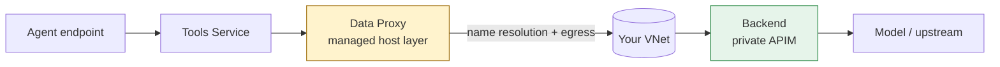

# Platform Pattern — Foundry Agent networking & the private-APIM path

> This document is the "why" behind the diagnostic. It models the Foundry Agent call path,
> explains the network characteristics of the managed **Data Proxy**, and contrasts the official
> private-APIM isolation pattern (referred to here as **Template 16**) with the common
> BYO **internal-mode APIM + custom FQDN** configuration that breaks.

## The call path

A Foundry Agent request to a BYO backend (e.g. an Azure API Management gateway fronting your
models) traverses several managed hops before it ever reaches your network:

The hop this tool focuses on is **Data Proxy → backend**. Everything before it is platform-managed;
everything from your VNet onward is yours. The failure mode we target lives precisely at that
boundary: name resolution of the backend FQDN on the managed path.

## Data Proxy network characteristics

The Data Proxy is a **managed host layer**. Two properties matter for diagnosis:

1. **It consumes delegated subnet IPs.** In a Standard Agent BYO VNet setup, the agent subnet is
   delegated to `Microsoft.App/environments`; the platform places managed hosts there and consumes
   IPs on that path. This is why subnet delegation is part of Check 3 and Check 4.
2. **Its DNS resolution path is managed, not your VM's.** A jump-box VM in the same VNet may resolve
   the backend FQDN perfectly while the Data Proxy's resolution still fails. That gap — "VM is fine,
   agent is not" — is the entire point of the Check 1 baseline vs the Check 5 observation.

> **Honesty rule:** there is no publicly documented, supported way to inject a custom DNS server or
> custom Private Resolver directly into the Data Proxy. We therefore do **not** claim the Data Proxy
> "never" uses this VNet's DNS. Check 5 reports what was observed; the rest is "needs verification".

## The official pattern (Template 16)

The supported private-APIM isolation pattern, as published in the foundry-samples network-secured
Standard Agent templates, looks like this:

| Dimension | Official (Template 16) |
| --- | --- |
| APIM exposure | **Inbound Private Endpoint** on the APIM service |
| Backend DNS zone | `privatelink.azure-api.net` (Azure-managed private DNS zone) |
| Foundry connection category | `ApiManagement` for a direct Azure APIM gateway |
| Agent subnet delegation | `Microsoft.App/environments` |
| Private DNS zone link | Backend zone linked to the resolver path the agent uses |

Because the APIM hostname lives in `privatelink.azure-api.net` and the Private Endpoint registers
its private IP there, the managed resolver path has a well-known, Azure-integrated zone to resolve
against.

## Why "internal-mode APIM + custom FQDN" diverges

A very common BYO configuration — especially in regulated enterprises — looks different:

| Dimension | Observed (divergent) | Network impact |
| --- | --- | --- |
| APIM exposure | Classic **internal VNet mode** (no inbound PE) | Publishes a VIP the managed resolver path may not resolve |
| Backend DNS zone | **Custom private-only FQDN** (`*.<your-domain>`) | Lives in a zone that must be **explicitly linked** to the resolver the Data Proxy uses |
| Connection category | `ModelGateway` / custom | Can change how the hostname is presented to the Data Proxy |
| Private DNS zone link | Often not linked to the managed resolver path | **The single most common break** — resolution fails before the backend is reached |

The symptom is textbook: from the VM, `nslookup` of the backend FQDN succeeds; from the agent, the
call fails with `Name or service not known` — a **name-resolution failure before the backend is
reached**, not a backend or TLS failure. Checks 1–2 establish that the backend is healthy and
reachable; Checks 4–6 localize the break to the resolution stage on the managed path.

## Reusability

This pattern is not specific to any one environment. The same "BYO VNet + private gateway + custom
internal DNS" shape recurs across **telco, financial services, and manufacturing** organizations who
require strict egress control. The Template 16 diff and the 3-way DNS verdict are reusable for any
of them — which is exactly why this asset is config-driven with zero hardcoded identifiers.

See [`docs/REFERENCES.md`](REFERENCES.md) for the official sources behind every claim above.
